## Introduction

Most conversations about lead conversion focus on targeting: the right country, the right industry, the right job title. This study asks a simpler question first — does the structure of the data and the way leads are worked matter more than who they are?

Using a simulated dataset of roughly **61,721 lead records**, built to reflect real CRM and call-log patterns, I ran logistic regression and conversion-rate comparisons across four angles: data completeness, record age, seniority and geography, and contactability.

## Methodology

Each factor was tested as its own logistic regression model, with conversion (yes/no) as the dependent variable. Some tests use the full dataset; others use a smaller cohort worked over a defined outreach window, matching how the original analysis was scoped.

> **Study snapshot:** logistic regression modeling, conversion-rate comparison across segments, time-window analysis (30/90/180/365 days), and call-level contactability comparisons.

## Data Completeness Is a Strong Predictor on Its Own

Each lead carries a "database score," a proxy for how complete and verified its record is. Logistic regression against this score returns a coefficient of **0.4065** and an odds ratio of roughly **1.50** — each one-point increase in score is associated with about 50% higher odds of conversion.

The bucketed view makes the effect easier to see. The 70–74 range is the single largest band at **27,930 records**, yet converts at only **0.91%**. Records scoring 80 and above make up about **16% of total leads** but generate roughly **85% of all conversions**, climbing from **27%** at 80–84 to over **97%** at 90 and above.

 converts at under 1%.")

That's a volume-versus-value problem: a large share of the database is low-probability, incomplete records. Improving verification at the point of entry looks like it would do more for conversion than adding raw volume to the bottom of the funnel.

## Record Age Drives Short-Term Speed, Not Long-Term Ceiling

The second question was whether a fresher record converts faster, or simply converts more. I measured how many conversions landed within 30, 90, 180, and 365 days of the record being created.

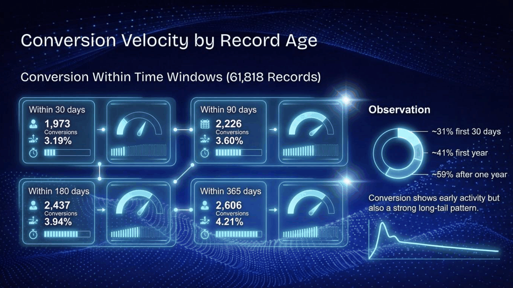

About **31%** of total conversions happen within the first 30 days, and **41%** within the first year — meaning most conversions still land after a record's first year. Fresh records drive short-term velocity, but older records keep converting well past that point.

## Seniority Matters Far More Than Geography

Next, I tested whether country or job level had a meaningful effect on conversion probability, using a multivariate logistic regression with the largest market and the Manager job level as the baseline (about **5.6%** probability of conversion).

, while job-level coefficients swung much wider, from -0.89 for Director-level leads to +1.05 for Vice President-level leads.")

Country barely moved the needle, with coefficients ranging only from **-0.19 to +0.08**. Job level told a different story: **Vice President** and **Executive** leads converted at roughly **2.7–2.85× higher odds** than a Manager, while **Director** and **C-Level** leads converted at **54–59% lower odds** — a role-fit problem, not a targeting or geography one.

## Whether a Lead Was Ever Actually Reached Was the Biggest Driver of All

The last angle looked at contactability: whether a lead ever had a genuinely connected call, versus never being reached. This was measured independently across two separate outbound calling channels, referred to here as **Channel A** and **Channel B**.

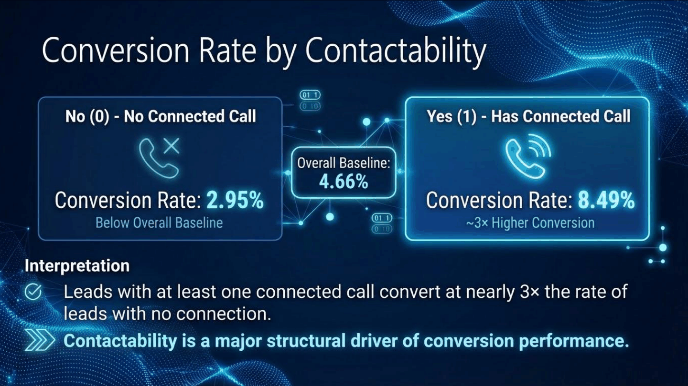

On both channels, a connected call lifted conversion roughly **3×**: **8.49%** vs **2.95%** on Channel A, **9.3%** vs **3.4%** on Channel B. Yet **69%** of Channel A leads and **53%** of Channel B leads had no connected call at all. This is an association, not proof of causation, but the consistency of the gap across two independent channels is hard to dismiss as noise.

> **Key read:** low conversion rates here were not primarily a targeting or geography problem. A large share of leads simply never reached meaningful engagement in the first place.

## Executive Summary

Put together, the four factors don't carry equal weight. Conversion was driven primarily by whether meaningful contact was established, supported by how complete the underlying data was. Country and record age mattered less by comparison.

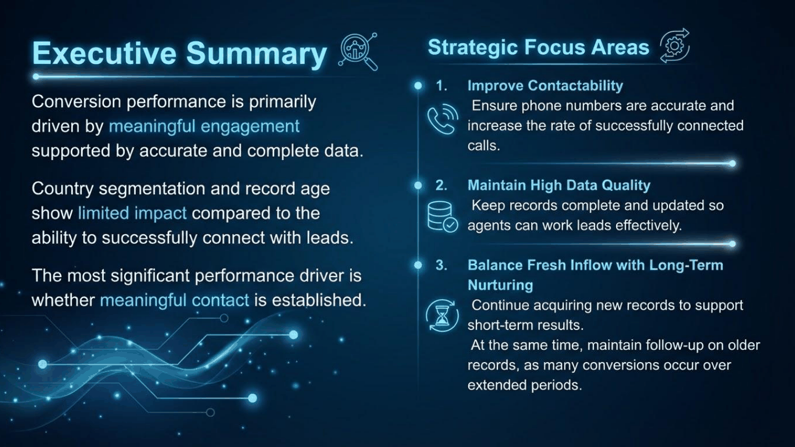

## View the Original Presentation Slides

Below is a curated set of the original slides used to work through this analysis (view only — click any slide to open it larger).

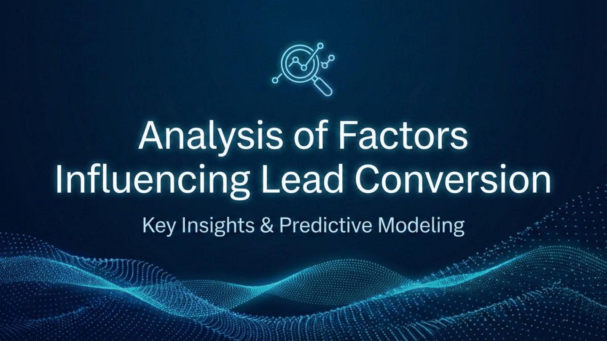 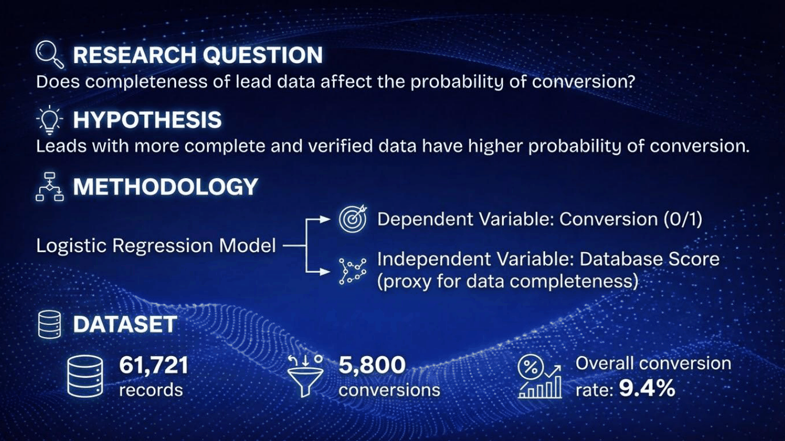 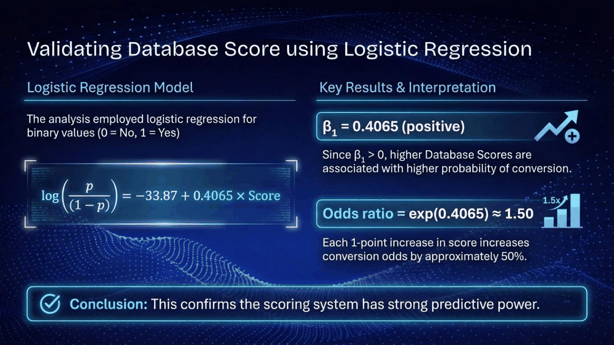 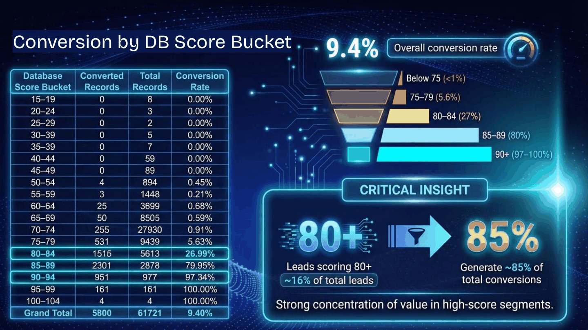 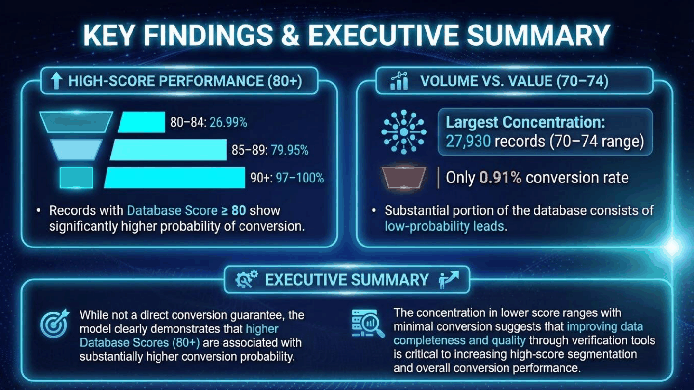 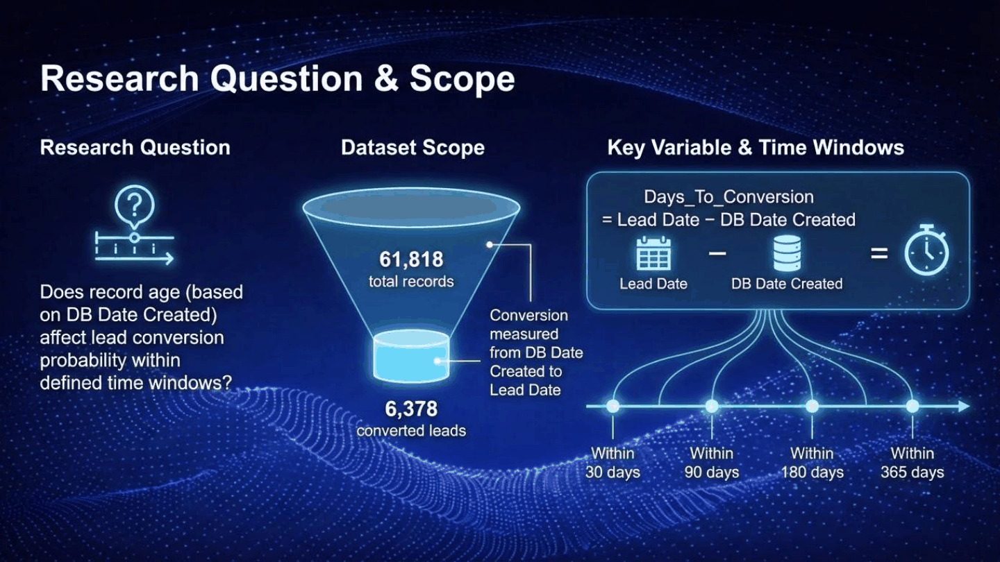  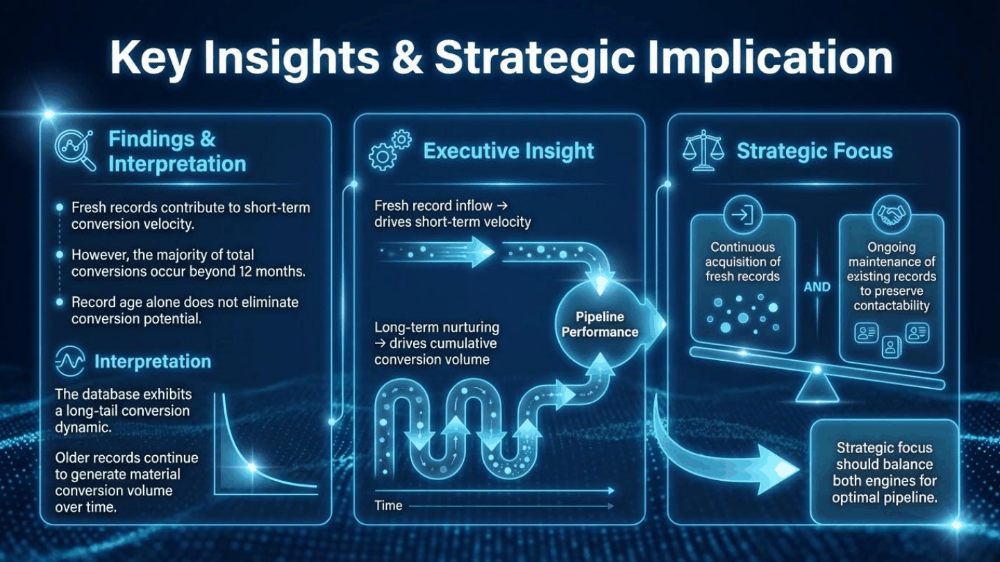 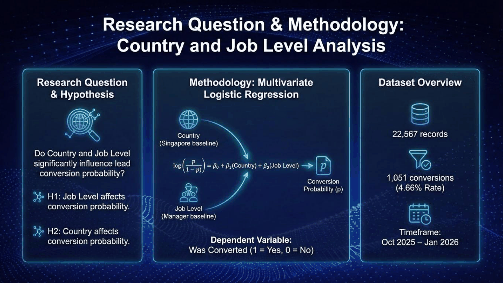 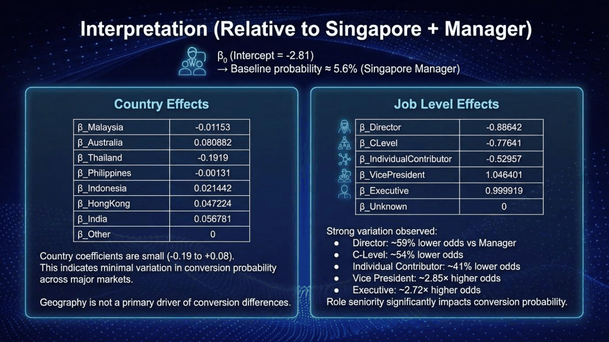 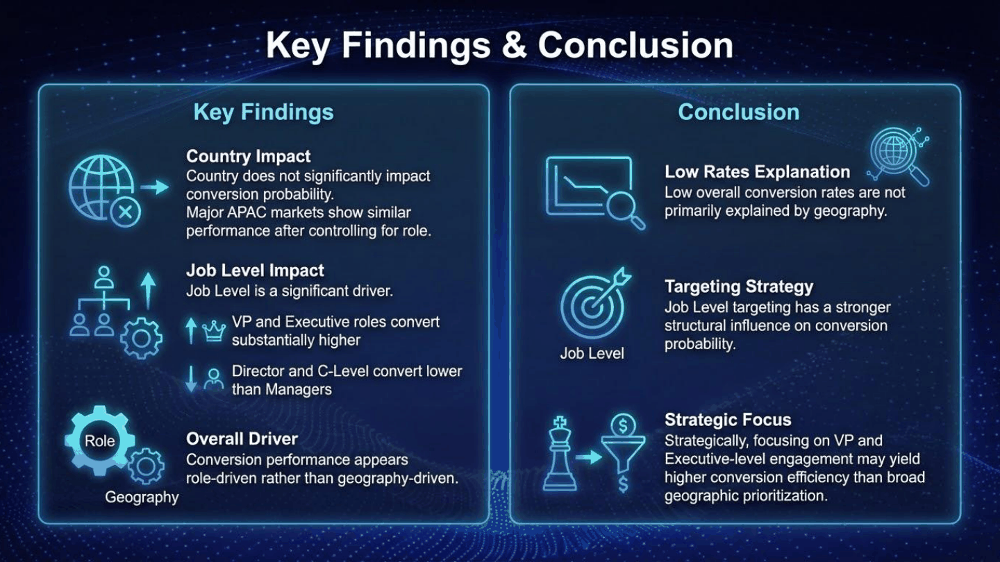 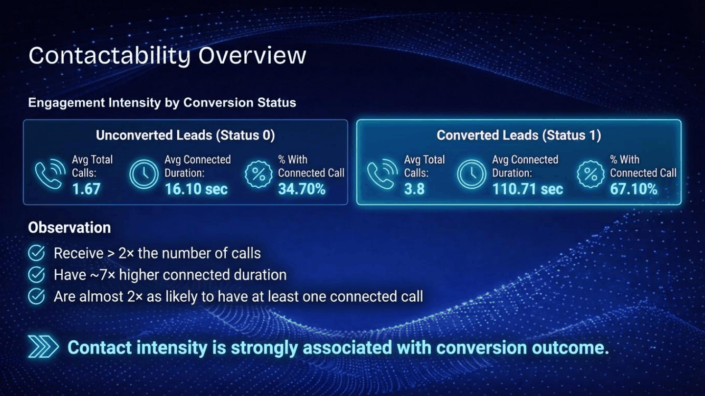  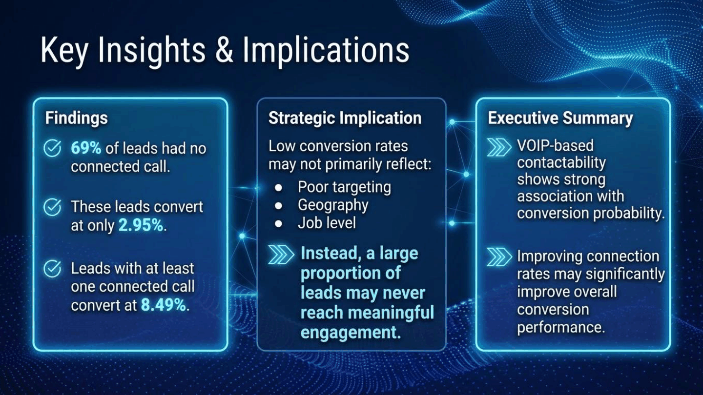 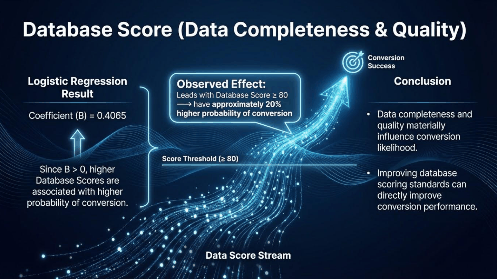 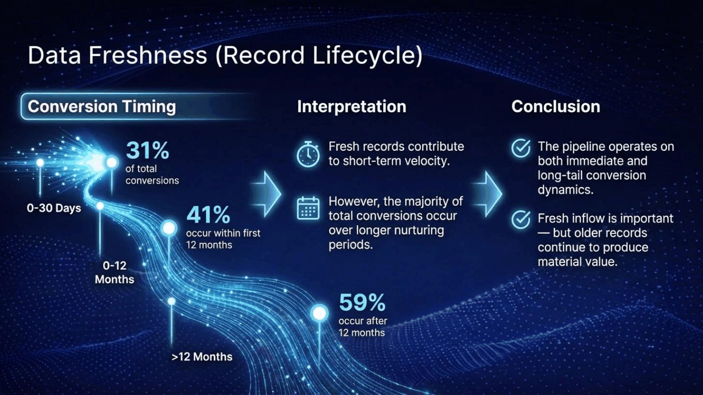 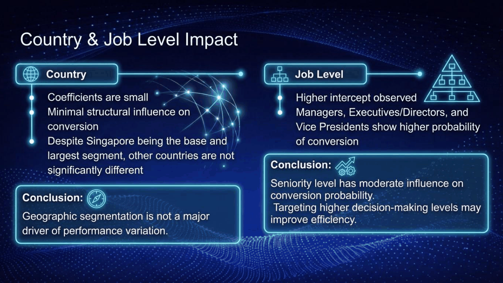 

## Key Takeaways

- **Data completeness is one of the strongest levers.** Leads scoring 80+ made up 16% of leads but generated 85% of conversions.
- **Record age affects speed, not ceiling.** Most conversions still land more than a year after the record was created.
- **Geography barely matters once you control for role.** Country coefficients ranged only from -0.19 to +0.08.
- **Seniority has a strong, non-linear effect.** VP-level leads converted at ~2.8x the odds of Managers; Directors and C-Level leads converted worse than Managers.
- **Contactability was the single biggest driver.** A connected call lifted conversion roughly 3x across two independent channels, yet over half of leads were never successfully reached.

## Tools Used

- **Python** — data analysis
- **Visual Studio Code + Claude Code** — for AI-assisted analysis
- **Gemini + ChatGPT** — for the data visualizations
- **GitHub** — for deployment
