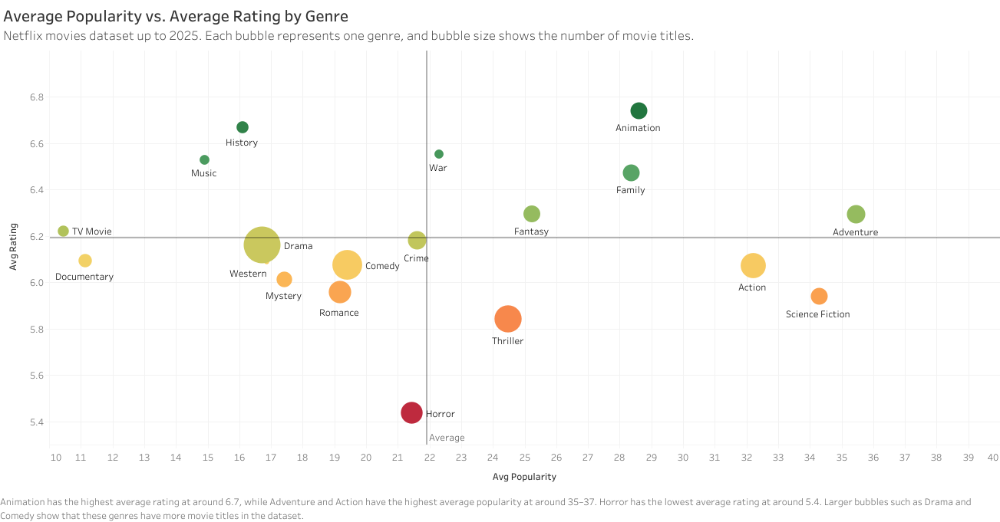
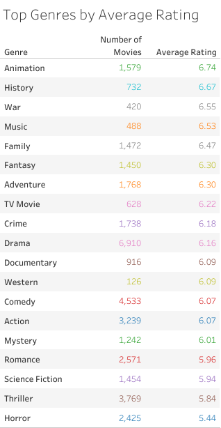
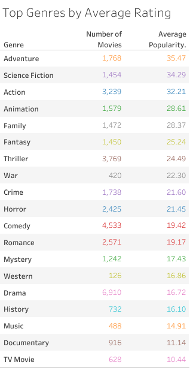
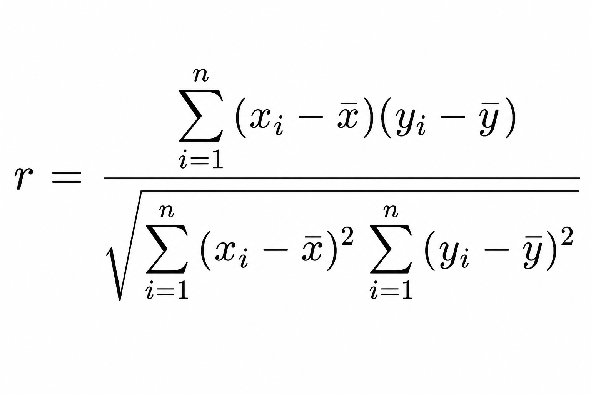

## Introduction

Netflix has one of the largest movie catalogs in streaming, covering family films, anime, action, documentaries, horror, romance, and many other categories. That variety makes genre analysis useful because title volume alone does not explain how well a category actually performs. A genre can have thousands of titles and still feel weak if audience response is inconsistent.

For this study, I looked at Netflix movie data up to 2025 and compared genres using three measures: average rating, average popularity, and title count. The goal was to see which genres perform strongly, which ones serve narrower audiences, and whether having more titles in a genre actually leads to better outcomes.

## Methodology

The original dataset contained roughly **16,000 movie records**. Because the genre field included multiple comma-separated labels, each title had to be expanded into separate genre rows before analysis. A movie tagged as Action, Animation, and Comedy was counted once under each of those categories.

After cleaning, the expanded genre dataset reached **37,460 rows**. From there, I summarized the data by average rating, average popularity, title count, and total vote count, then used Tableau to compare the final **19 genre groups**. That produced a much clearer view of how reach and satisfaction differ across the catalog.

> **Study snapshot:** original dataset of about **16,000 rows**, expanded to **37,460 genre rows**, then summarized into **19 final genre bubbles** for comparison.

## Animation Leads in Rating and Stays Strong in Popularity

Animation is the strongest all-around genre in this dataset. It records the highest average rating at **6.74** and still maintains strong average popularity at **28.61** across **1,579 titles**. While Adventure, Science Fiction, and Action lead the popularity ranking, Animation stands out because it balances both broad interest and positive viewer response.

That matters more than a simple top-three ranking. Some genres win attention but not satisfaction, while others rate well without reaching a wide audience. Animation performs strongly on both sides, which makes it the most complete genre performer in the study.

The result also lines up with how Netflix has expanded animated movies and anime. Animation is no longer just a kids category. It reaches family viewers, anime audiences, and even older viewers looking for highly visual storytelling, which helps explain why it performs well across different signals at the same time.

## History and Music Show Niche Strength

History and Music do not rank near the top in popularity, but both perform well in average rating. History reaches **6.67** in rating with **16.10** in popularity across **732 titles**, while Music reaches **6.53** in rating with **14.91** in popularity across **488 titles**.

That pattern suggests these genres serve more focused audiences rather than mass-viewer demand. They may not attract the same attention as Action or Adventure, but the viewers who choose them appear to respond more positively once they do.

> **Important pattern:** high rating does not always mean high popularity. History and Music perform more like satisfaction genres than reach genres.

## Horror Has Scale, but Weak Average Rating

Horror is one of the clearest underperformers in the dataset. It carries **2,425 titles**, making it one of the larger genres in the catalog, yet it records the lowest average rating at **5.44**. Its average popularity sits at **21.45**, which means the genre still attracts viewers even if satisfaction remains weak.

That combination points to a quality gap. Horror may bring in clicks because the genre has a loyal audience and seasonal demand, but title volume is not translating into stronger ratings. If too many releases feel repetitive, low-budget, or forgettable, the catalog can still get watched while dragging its average quality perception down.

The data does not say Horror has no value. It says broad volume alone is not working. A smaller set of stronger horror titles would likely outperform a larger pool of weaker ones.

## Kids and Family Content Punch Above Their Size

Animation, Family, and Adventure appear near the top of the study for a reason. Together, Animation and Family account for about **14%** of the unique movie catalog, or roughly **2,241 out of 15,893 titles**. That is not a majority share, but these categories generate stronger engagement than their size alone would suggest.

Animation benefits from a wider audience than the usual kids-content label suggests. It includes family films, anime, and adult animation, which helps it travel across age groups. Adventure adds another layer because it often overlaps with family, action, fantasy, and animation, making it one of the broadest appeal genres in the dataset.

The better conclusion is not that Netflix wins here because it simply has more children's content. It wins because Animation, Family, and Adventure combine accessibility, repeat viewing, and strong audience fit.

## More Titles Do Not Guarantee Better Performance

One of the most useful takeaways from this study is that catalog size does not strongly predict success. The relationship between title count and average rating is slightly negative at around **-0.35**, while the relationship between title count and average popularity is weak at around **+0.11**.

In practical terms, having more titles in a genre does not automatically produce better ratings or stronger audience interest. Drama, for example, has **6,910 titles** but only moderate rating and popularity performance. Animation, by contrast, has far fewer titles but leads the rating ranking and stays strong in popularity.

That matters for content strategy. A large catalog increases choice, but it does not guarantee stronger viewer response. Quality, positioning, audience fit, and genre expectations matter more than raw volume.

## Key Takeaways

- **Animation is the strongest all-around genre.** It leads the rating ranking at **6.74** while staying strong in popularity at **28.61**.
- **Adventure, Science Fiction, and Action lead popularity.** These genres benefit from broad visual appeal and wider audience reach.
- **History and Music are niche but well-rated.** They show that smaller audience categories can still deliver strong viewer satisfaction.
- **Horror has a clear quality gap.** It carries **2,425 titles** but records the weakest average rating at **5.44**.
- **Genre volume is not enough.** Title count has only a weak relationship with popularity and a slightly negative one with rating.
- **Kids and family content outperform their catalog share.** Animation and Family make up about **14%** of unique titles but produce stronger engagement than that share would suggest.

## Sources

1. Netflix movies dataset up to 2025, used for the genre-level calculations and Tableau visuals in this study.
2. [Señal News](https://senalnews.com/en/content/netflix-more-than-half-of-members-watch-anime) on the global scale of anime viewership among Netflix members.
3. [Licensing.biz](https://www.licensing.biz/netflix-kids-content-report/) coverage of Netflix kids content and animated engagement trends.
4. [Deloitte Insights](https://www2.deloitte.com/) for broader audience and genre preference context.
5. [Entertainment Strategy Guy](https://entertainmentstrategyguy.com/) for streaming and seasonal content performance context.
6. [Netflix Tudum](https://www.netflix.com/tudum) for category and audience context around music and documentary viewing.

This analysis suggests that genre performance on Netflix is not just about catalog size. Animation, Family, and Adventure succeed because they combine broad appeal, repeat viewing, and strong audience fit, while Horror shows the risk of scale without consistent quality.
