## Introduction

Pokémon has been part of my life since childhood. I first discovered it through **Pokémon Emerald**, and from there I got hooked. I played the mainline Gen 3 games like **Emerald, Sapphire, FireRed,** and **LeafGreen**, then moved into the Nintendo DS era with **Black, White, Black 2, White 2, HeartGold,** and **SoulSilver**. Years later, I continued with the Switch titles like **Sword/Shield, Scarlet/Violet,** and **Legends: Arceus**.

Now that Pokémon continues to stay popular with newer titles like **Pokémon Legends: Z-A**, I wanted to look at the franchise in a different way: not only as a player, but as a data analyst.

For this study, I used a cleaned Pokémon dataset based on public data from Kaggle. The dataset covers **1,025 Pokédex IDs** from **Generation 1 to Generation 9**, with **1,207 total rows** after including alternate forms, Mega Evolutions, Primal forms, Paradox forms, and other special variants.

The final dataset includes the familiar battle stats like **HP, Attack, Defense, Special Attack, Special Defense,** and **Speed**, but it also includes extra fields such as **type matchups, experience growth, height, weight, base egg steps, base happiness, capture rate, official class,** and **special group**.

> **Questions that guided the study:** Which types are most common, which typings are strongest offensively and defensively, which Pokémon rise to the top among Standard Pokémon and Special Pokémon, whether defensive Pokémon are really slower, and whether Legendary and Mythical Pokémon are actually harder to catch and slower to train.

This study answers those questions using **Python, pandas, numpy,** and **matplotlib** inside VS Code.

## Section 1: Type Matchups

The first part of the study focuses on Pokémon types. At first glance, type matchups look like a simple rock-paper-scissors system. Fire beats Grass, Water beats Fire, Electric beats Water, and so on. But Pokémon becomes more interesting because many Pokémon have **two types**. A dual-type Pokémon can gain more resistances, more weaknesses, or sometimes both.

To study this, I generated an **18x18 type matchup matrix** and populated it with defensive damage multipliers.

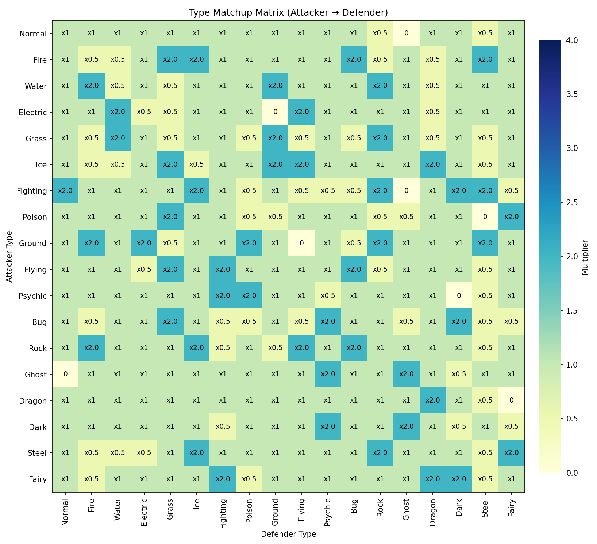

Q1 Which Single-typing is the most and least common?

The most common single type is **Water**, with **81 single-type Water Pokémon**. The least common single type is **Flying**, with only **4 single-type Flying Pokémon**.

This makes sense from a game-design point of view. Water Pokémon appear across oceans, rivers, lakes, fishing encounters, surfing routes, and many regional Pokédex areas. Flying, on the other hand, is often paired with Normal, so pure Flying Pokémon remain rare.

Q2 Which Double-typing is the most and least common?

The most common dual typing is **Normal/Flying**, with **31 Pokémon**. Several dual-type combinations appear only once in the dataset.

- `Fairy/Ice` - Alolan Ninetales
- `Electric/Psychic` - Alolan Raichu
- `Dragon/Fairy` - Mega Altaria
- `Bug/Ghost` - Shedinja
- `Steel/Water` - Empoleon
- `Normal/Water` - Bibarel
- `Ghost/Ice` - Froslass
- `Electric/Fire` - Rotom Heat Rotom
- `Fire/Steel` - Heatran

Normal/Flying being the most common is not surprising. Early-route birds have been a repeated design pattern since Gen 1, and many of them share that typing.

Q3 Which Double-typings do not appear even once?

Not every possible dual-type combination exists in the dataset. Out of the full set of possible pairings, **9 dual typings** do not appear at all.

- `Bug/Dragon`
- `Bug/Normal`
- `Fairy/Fire`
- `Fairy/Ground`
- `Ghost/Rock`
- `Ice/Normal`
- `Ice/Poison`
- `Normal/Rock`
- `Normal/Steel`

That gap is interesting because the type chart allows these combinations, but the series has still never used them in an official Pokémon design through this dataset.

Q4 Which Single-typing has the best offensive capability?

**Fighting** and **Ground** are tied as the best offensive single types. Each one hits **5 types** for super-effective damage.

Fighting is strong against Normal, Ice, Rock, Dark, and Steel. Ground is strong against Fire, Electric, Poison, Rock, and Steel. Both are strong offensive types, but they win in different matchups.

Q5 Which Single-typing has the best defensive capability?

**Steel** is the best defensive single type, with a defensive score of **10**. It has **11 resistances** and only **3 weaknesses**, making it one of the strongest defensive types in the game.

This explains why Steel Pokémon often feel hard to break. Even when their stats are not always the highest, their type profile gives them many safe matchups.

Q6 Which Single-typing has the worst offensive capability?

**Normal** is the worst offensive single type. Normal has **0 super-effective matchups**. It does not hit any type for extra damage, and it cannot affect Ghost-type Pokémon at all.

This does not mean Normal Pokémon are useless. Many Normal Pokémon have strong stats or good move pools. But as an attacking type alone, Normal has the weakest offensive coverage.

Q7 Which Single-typing has the worst defensive capability?

**Ice** is the worst defensive single type, with a defensive score of **-3**. Ice has only **1 resistance** and **4 weaknesses**: Fire, Fighting, Rock, and Steel.

This confirms something many players already feel in battle: Ice is dangerous offensively, but fragile defensively.

Q8 Which Double-typing has the best offensive capability?

Several dual-type combinations are tied for the best offensive coverage, each with **7 super-effective matchups**.

- `Grass/Dark`
- `Grass/Ice`
- `Grass/Psychic`
- `Rock/Fighting`
- `Rock/Psychic`

This shows that dual typing can greatly expand offensive reach. Some combinations cover many more matchups than either type could handle alone.

Q9 Which Double-typing has the worst offensive capability?

Several dual-type combinations have only **1 super-effective matchup**.

- `Bug/Steel`
- `Dark/Ghost`
- `Dark/Poison`
- `Electric/Water`
- `Normal/Ghost`
- `Water/Ground`

This is interesting because some of these typings are still good defensively. A typing can be poor offensively but strong as a defensive profile.

Q10 Which Double-typing has the best defensive capability?

**Fairy/Steel** and **Steel/Ghost** are tied as the strongest defensive combinations, each with a defensive score of **11**.

These combinations resist many attacker types and have very few bad matchups. This is why Pokémon with these typings often feel difficult to remove from battle.

Q11 Which Double-typing has the worst defensive capability?

**Grass/Dragon** and **Ice/Psychic** are tied for the weakest defensive score at **-4**.

Both combinations suffer from several weaknesses and limited resistance value. This makes them harder to use defensively, especially against teams with wide type coverage.

## Section 2: Base Stats

After type matchups, the next part of the study focuses on base stats. Every Pokémon has six main stats: **HP, Attack, Defense, Special Attack, Special Defense,** and **Speed**. These numbers shape how a Pokémon performs in battle, from raw physical damage to bulk and turn order.

For the ranking questions in this section, I split the dataset into **two reader-friendly groups**. **Standard Pokémon** refers to the main regular roster, while **Special Pokémon** refers to alternate forms and rare high-tier entries such as Mega Evolutions, Primal forms, Ultra Beasts, Paradox forms, Mythicals, Legendaries, and other non-standard variants.

> **Why the split matters:** if everything is ranked together, special forms and rare high-tier entries immediately dominate the charts. Splitting them creates a cleaner comparison: Standard Pokémon show the regular roster on its own terms, while Special Pokémon isolate the extreme side of the dataset.

The Standard Pokémon group contains **990 rows**, while the Special Pokémon group contains **217 rows** in the current cleaned dataset.

Q12A Which Standard Pokémon have the highest total base stats?

Among Standard Pokémon, **Slaking** ranks first with **670 total base stats**. The next few names are **Palafin Hero Form (650)**, **Greninja Ash-Greninja (640)**, and **Wishiwashi School Form (620)**.

This is a much more interesting result than the old mixed ranking because it highlights powerful non-legendary roster entries without letting Mega or legendary forms immediately take over the chart.

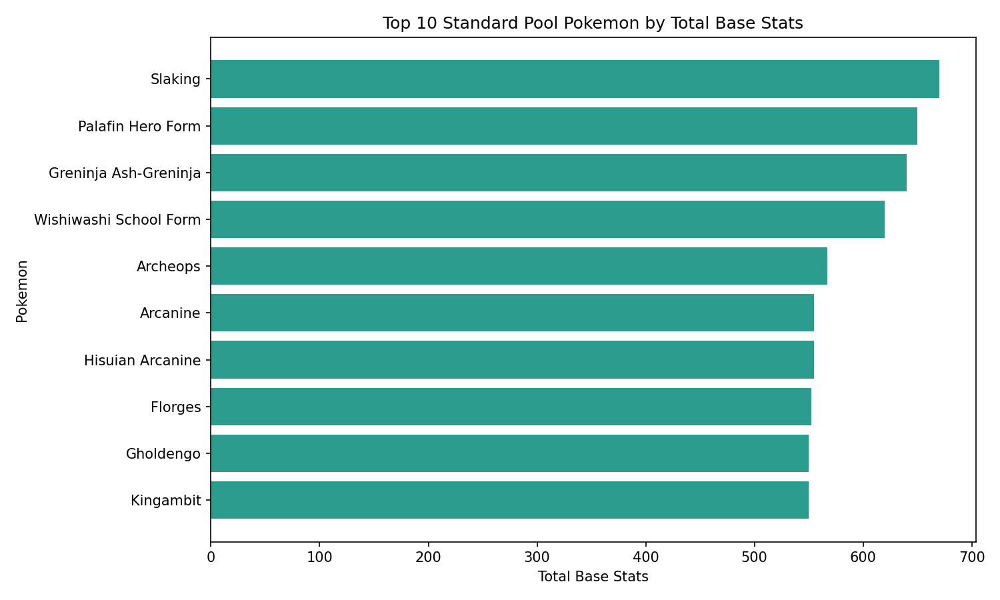

Q12B Which Special Pokémon have the highest total base stats?

Among Special Pokémon, **Eternatus Eternamax** ranks first by a huge margin with **1,125 total base stats**. Behind it are **Mega Mewtwo X**, **Mega Mewtwo Y**, and **Mega Rayquaza**, all tied at **780**, followed by **Primal Groudon** and **Primal Kyogre** at **770**.

Once the full non-standard bucket is included, the chart becomes a true ranking of extreme forms rather than a tiny Mega-only snapshot.

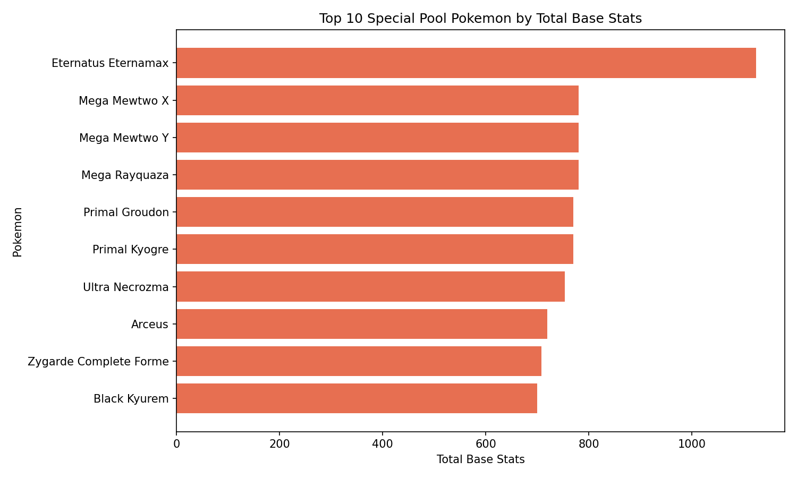

Q13A Which Standard Pokémon have the highest Attack?

Among Standard Pokémon, **Rampardos** has the highest Attack at **165**. The next tier includes **Galarian Zen Mode**, **Palafin Hero Form**, and **Slaking**, all at **160**.

That is a good reminder that extreme physical power is not limited to legendary or mythical Pokémon. Some Standard Pokémon still hit incredibly hard on paper.

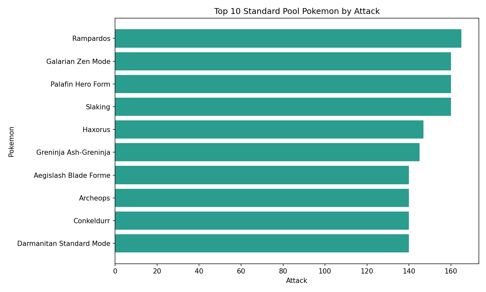

Q13B Which Special Pokémon have the highest Attack?

Among Special Pokémon, **Mega Mewtwo X** leads with **190 Attack**. After that come **Mega Heracross (185)**, **Kartana (181)**, **Deoxys Attack Forme (180)**, **Mega Rayquaza (180)**, and **Primal Groudon (180)**.

This version of the chart is much richer because it includes Mega forms, Ultra Beasts, Mythicals, and legendary battle forms together.

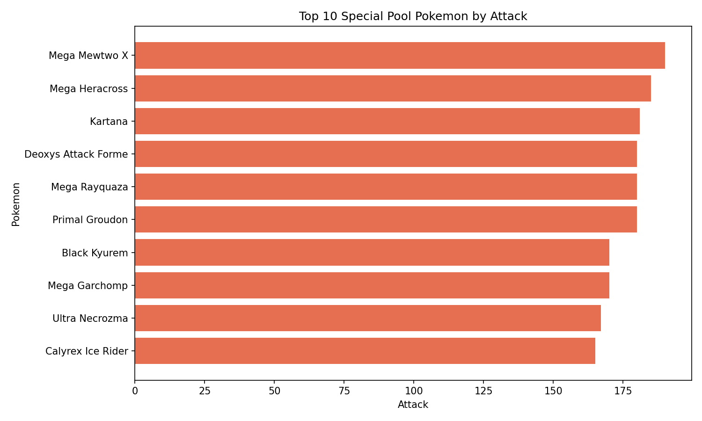

Q14A Which Standard Pokémon have the highest Defense?

Among Standard Pokémon, **Shuckle** ranks first with a huge **230 Defense**. It is followed by other famous walls such as **Steelix (200)**, **Avalugg (184)**, **Hisuian Avalugg (184)**, and **Aggron (180)**.

The Standard Pokémon group makes the defensive specialists stand out much more clearly than the old mixed ranking did.

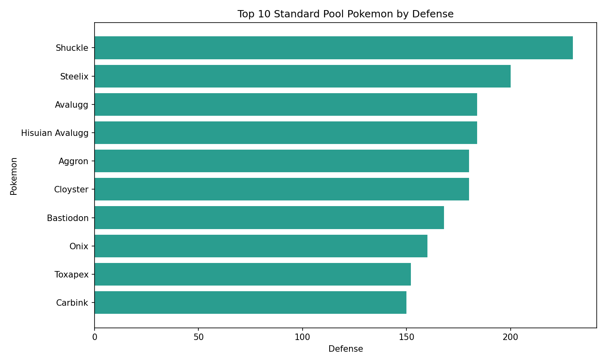

Q14B Which Special Pokémon have the highest Defense?

Among Special Pokémon, **Eternatus Eternamax** dominates Defense with **250**. It is followed by **Mega Aggron (230)**, **Mega Steelix (230)**, and **Stakataka (211)**.

Compared with Standard Pokémon, this group includes more extreme outliers designed around very high stat ceilings.

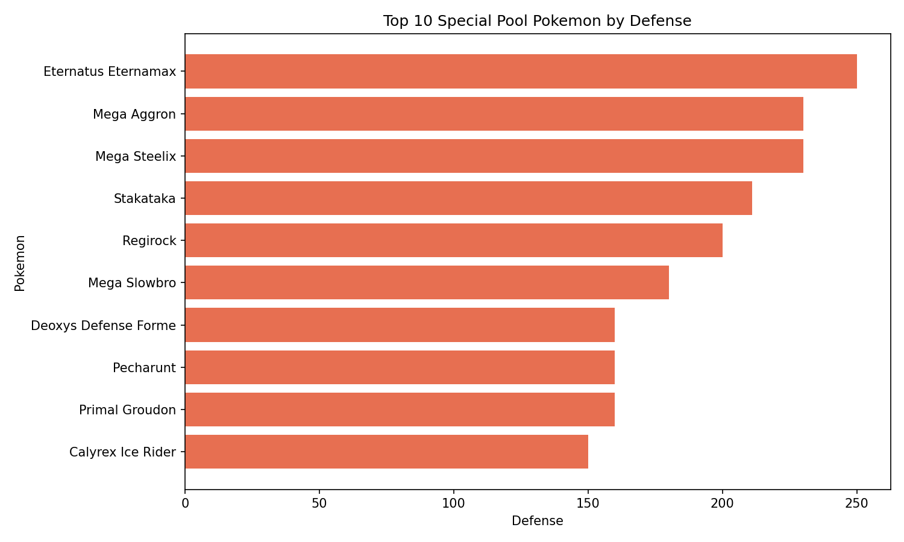

Q15A Which Standard Pokémon have the highest Special Attack?

Among Standard Pokémon, **Greninja Ash-Greninja** ranks first with **153 Special Attack**. It is followed by **Chandelure**, **Cursola**, and **Vikavolt**, each at **145**.

This ranking is more useful than the old version because it highlights elite special attackers that still belong to the regular battle roster.

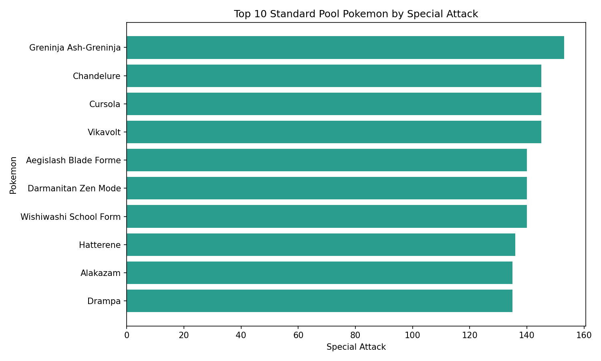

Q15B Which Special Pokémon have the highest Special Attack?

Among Special Pokémon, **Mega Mewtwo Y** ranks first with **194 Special Attack**. The next strongest entries are **Deoxys Attack Forme (180)**, **Mega Rayquaza (180)**, **Primal Kyogre (180)**, **Mega Alakazam (175)**, and **Xurkitree (173)**.

This is a more convincing Special Pokémon chart because it now reflects several different kinds of non-standard power spikes.

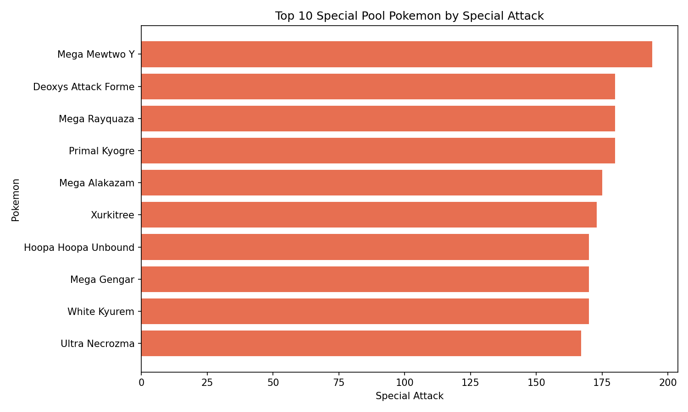

Q16A Which Standard Pokémon have the highest Special Defense?

Among Standard Pokémon, **Shuckle** also leads Special Defense with **230**. Behind it are **Florges (154)**, **Carbink (150)**, **Probopass (150)**, and **Toxapex (142)**.

This list mixes pure walls with bulky support-oriented species, which gives a better picture of natural special bulk in the main roster.

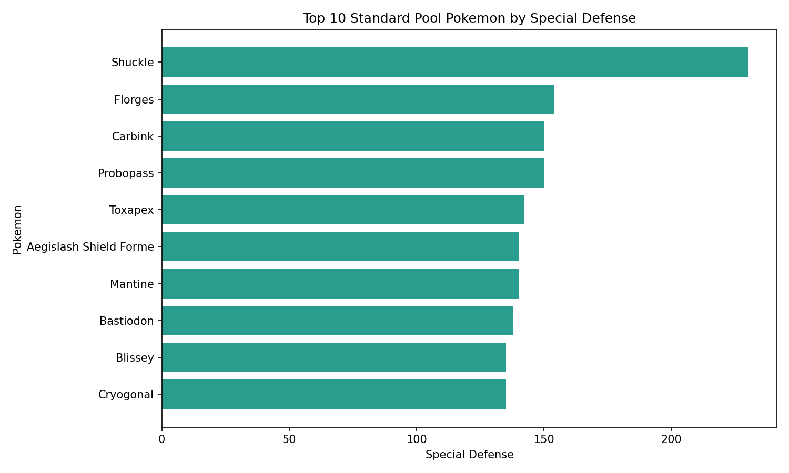

Q16B Which Special Pokémon have the highest Special Defense?

Among Special Pokémon, **Eternatus Eternamax** ranks first again with **250 Special Defense**. After that come **Regice (200)**, **Deoxys Defense Forme (160)**, **Primal Kyogre (160)**, **Ho-oh (154)**, and **Lugia (154)**.

The Special Pokémon group is no longer just about offense. It also contains some of the most exaggerated defensive stat profiles in the full dataset.

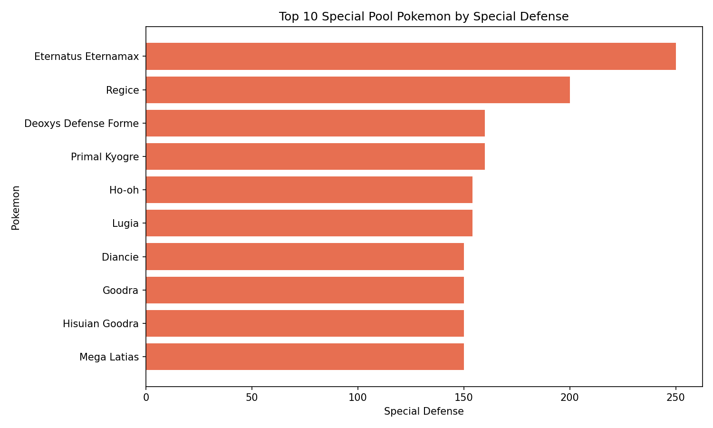

Q17A Which Standard Pokémon are the fastest?

Among Standard Pokémon, **Ninjask** is the fastest with a Speed stat of **160**. It is followed by **Electrode** and **Hisuian Electrode** at **150**, then **Accelgor (145)**.

This is a clean example of how speed monsters still exist outside the legendary and special-form tier.

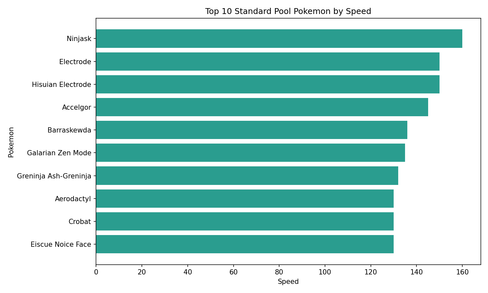

Q17B Which Special Pokémon are the fastest?

Among Special Pokémon, **Regieleki** is the fastest by far with **200 Speed**. It is followed by **Deoxys Speed Forme (180)**, **Pheromosa (151)**, **Calyrex Shadow Rider (150)**, and several Deoxys and Mega entries close behind.

This chart does a much better job of showing how many speed extremes live in the Special Pokémon group.

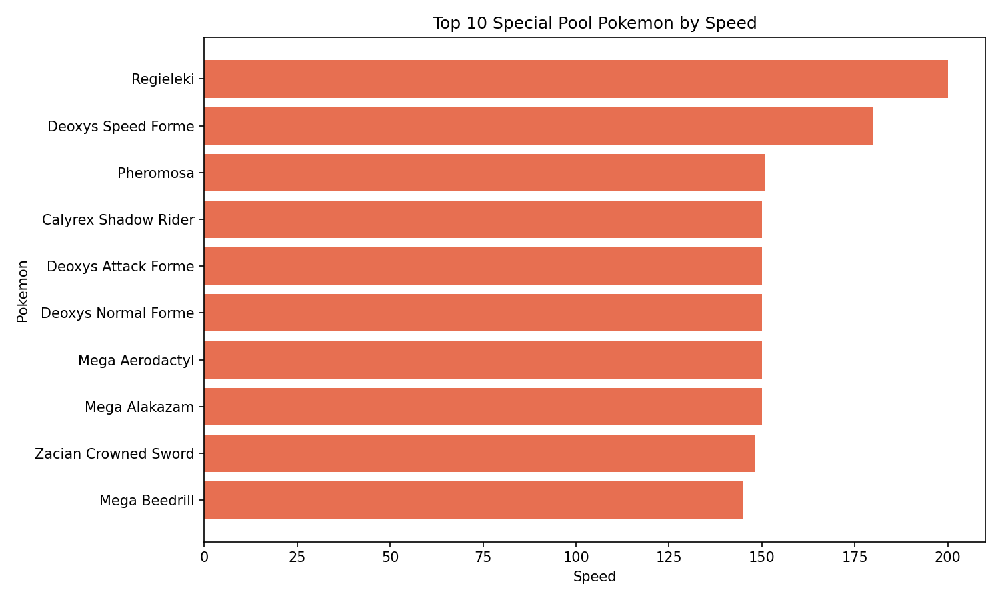

Q18 Are Pokémon with higher Defense usually slower?

For the correlation questions, I kept the **full 1,207-row dataset**. The goal here is to test broad stat relationships across the whole project, not only the two leaderboard buckets.

The data does **not** support the idea that Pokémon with higher Defense are usually slower. The Pearson correlation between Defense and Speed is **-0.0271**, while the Spearman correlation is **0.0300**. Both values are extremely close to zero.

This means there is no clear relationship between Defense and Speed in this dataset. Some defensive Pokémon are slow, but high Defense alone does not strongly predict low Speed.

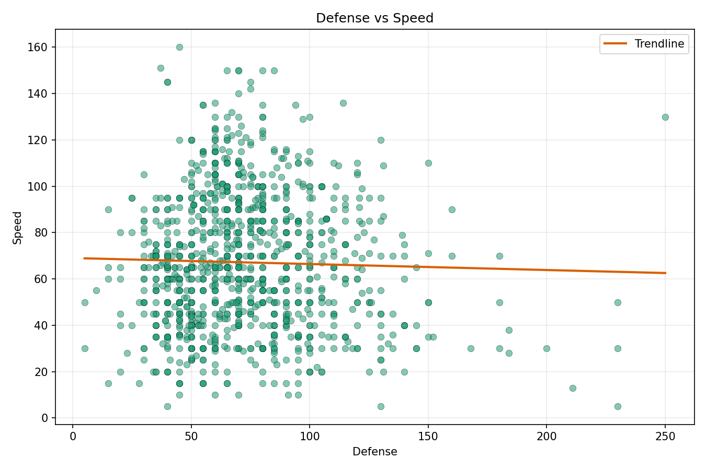

Q19 Are Pokémon with higher Attack usually slower?

The data also does **not** support the idea that high-Attack Pokémon are usually slower. The Pearson correlation is **0.3337**, and the Spearman correlation is **0.3283**.

This is a weak positive relationship, not a negative one. In this dataset, higher Attack tends to come with slightly higher Speed on average. The relationship is not strong, but it goes against the idea that physical attackers are usually slow.

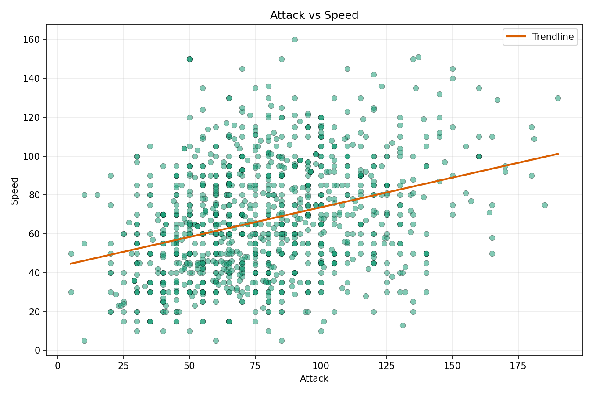

Q20 Are Pokémon with higher Special Attack usually slower?

The same pattern appears with Special Attack. The Pearson correlation is **0.3786**, and the Spearman correlation is **0.3631**. This is also a weak positive relationship.

In other words, Pokémon with stronger Special Attack tend to be slightly faster on average, not slower. Again, the relationship is weak, but the trend does not support the idea that stronger special attackers are usually slow.

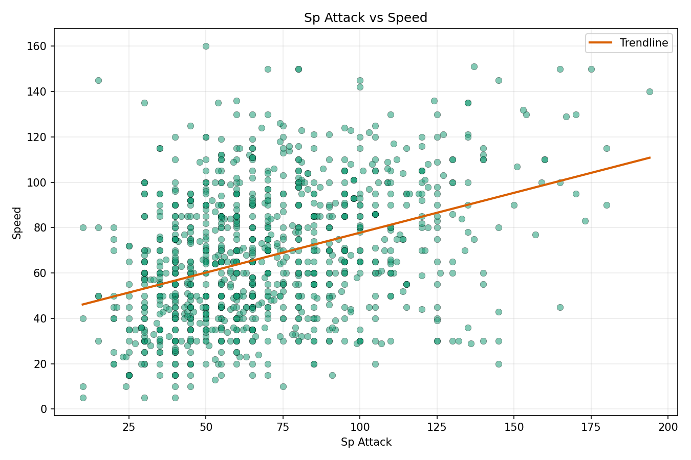

## Section 3: Capture Rate, Experience Growth, and Official Class

Not every Pokémon is designed to feel the same. Some are common encounters. Some are rare. Some are meant to be late-game challenges. Legendary and Mythical Pokémon often feel harder to catch and slower to train, but I wanted to test whether the dataset supports that idea.

For this section, I compared three fields: `capture_rate`, `experience_growth`, and `official_class`.

Q21 Do Legendary and Mythical Pokémon generally have lower capture rates?

Yes. Legendary and Mythical Pokémon generally have much lower capture rates.

- **Normal Pokémon:** `99.67`
- **Legendary Pokémon:** `16.65`
- **Mythical Pokémon:** `9.50`

This shows a clear pattern. Official class is strongly connected to capture difficulty. Legendary and Mythical Pokémon are much harder to catch on average than normal Pokémon.

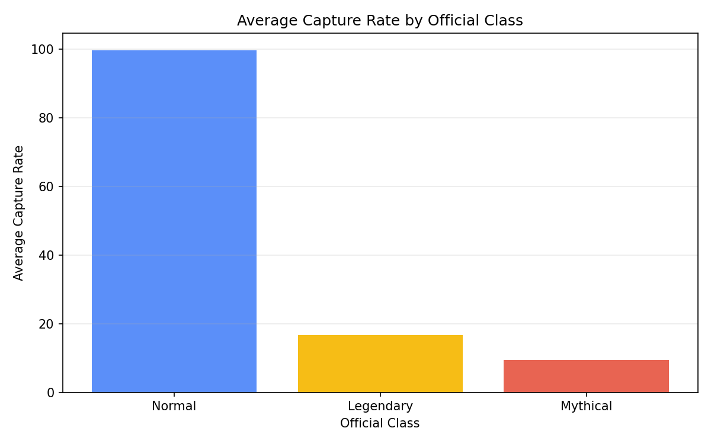 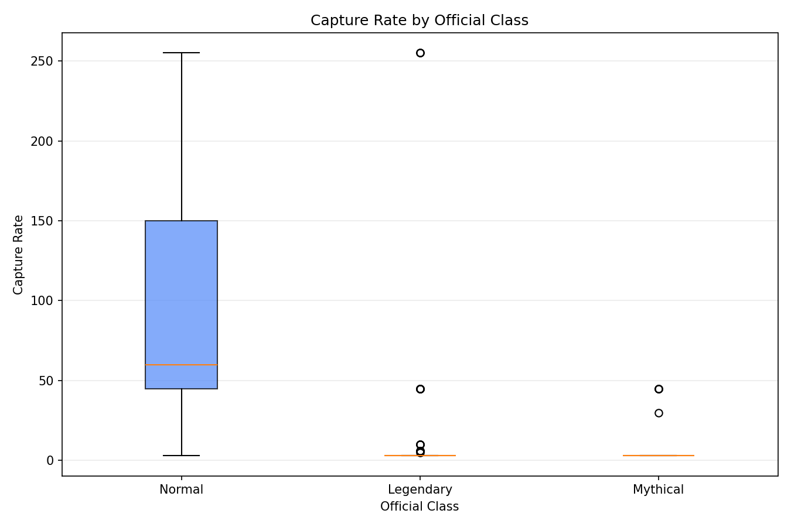

Q22 Do Legendary and Mythical Pokémon generally require more experience to reach Level 100?

Yes. Legendary and Mythical Pokémon generally require more experience to reach Level 100.

- **Normal Pokémon:** `1,046,900.35`
- **Legendary Pokémon:** `1,250,000.00`
- **Mythical Pokémon:** `1,224,648.00`

Legendary Pokémon usually follow the slowest growth curve, while Mythical Pokémon are also much closer to that higher requirement than normal Pokémon.

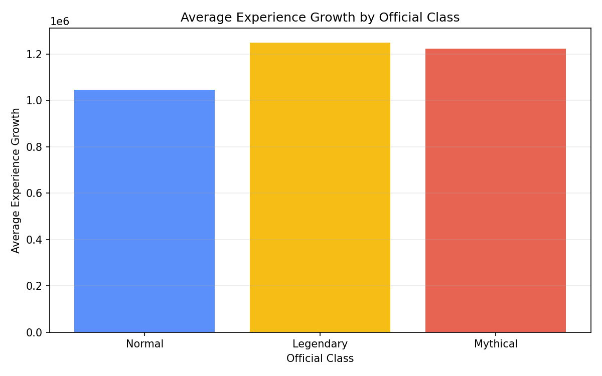 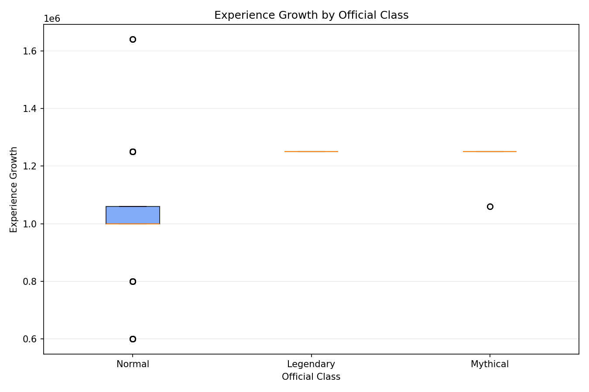

Q23 Is capture rate strongly related to experience growth?

Capture rate and experience growth are related, but not strongly enough to explain the full pattern by themselves. The Pearson correlation is **-0.2512**, and the Spearman correlation is **-0.4004**.

This means the relationship is weak to moderate and negative. Pokémon that need more experience growth tend to have lower capture rates, but the connection is not strong enough on its own. Something else explains the pattern better.

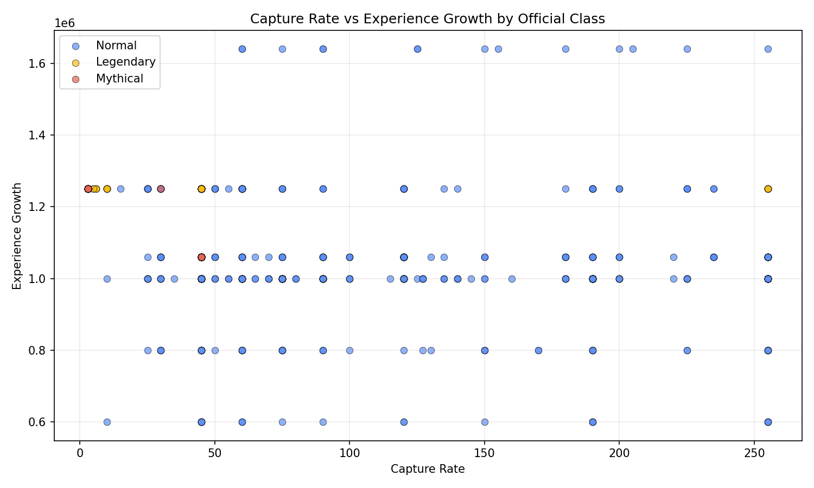

## Final Thoughts

What makes this dataset interesting is that it turns familiar Pokémon ideas into something measurable. Instead of relying only on player memory or competitive reputation, the numbers reveal which patterns truly repeat across the franchise.

The type section shows that design balance is not evenly distributed. Some typings appear constantly, while others are extremely rare or still unused. Water dominates single typings, Normal/Flying dominates dual typings, and a handful of possible pairings still have no official representative at all. That immediately shows that the Pokémon world is not just built from a complete logical grid. It is shaped by design habits, regional archetypes, and long-running franchise patterns.

The matchup results also reinforce an important distinction: offensive strength and defensive strength are not the same thing. Fighting and Ground stand out offensively among single types, while Steel stands out defensively. Dual typings make this even more dramatic. Some combinations create wide offensive reach, while others are valuable mainly because of resistance profiles. In other words, a type can look amazing in one context and weak in another.

The stat section became much more meaningful after separating **Standard Pokémon** from **Special Pokémon**. Without that split, rare forms with exaggerated stat ceilings would flatten the rankings and hide what is actually impressive inside the regular roster. With the split in place, the page shows two different truths at once: which regular Pokémon are naturally elite, and which special forms are designed to push the franchise beyond normal limits.

The capture-rate and experience findings reveal that rarity is not just a story concept. It is built directly into the numbers. Legendary and Mythical Pokémon are not only framed as special in lore, they are also made harder to catch and slower to raise. That means the gameplay systems, not just the narrative, help communicate importance and rarity to the player.

Another important takeaway is that common player assumptions are not always supported by the data. The correlation analysis does not show strong evidence that bulkier or stronger Pokémon are usually slower. That is a useful reminder that franchise-wide trends can be more nuanced than battle stereotypes suggest.

> **Big picture:** this study shows that Pokémon is built on layered design logic. Type distribution, stat ceilings, rarity systems, and progression difficulty all work together to shape how a Pokémon feels in battle and in the wider game world.

As a final takeaway, the data makes the series feel even more intentional. Behind the creatures, evolutions, and battle mechanics is a long-running system of choices about balance, identity, rarity, and power. That is what makes Pokémon such a good subject for analysis: even a game many people first experience as kids still holds a surprising amount of structural depth when viewed through data.

## Afterword and Source Credits

This project was made possible through public Pokémon datasets and community-maintained references. I used these sources as the foundation for building, cleaning, validating, and expanding the analysis dataset.

1. [Pokémon Dataset by Rounak Banik on Kaggle](https://www.kaggle.com/datasets/rounakbanik/pokemon)
2. [All Pokémon Dataset by maca11 on Kaggle](https://www.kaggle.com/datasets/maca11/all-pokemon-dataset)
3. [Pokémon Type Chart Gist by armgilles](https://gist.github.com/armgilles/194bcff35001e7eb53a2a8b441e8b2c6)
4. [Pokémon Database](https://pokemondb.net/)

The full project files, cleaned dataset work, generated charts, and analysis scripts can be found in my GitHub portfolio repository.

[View the Pokémon Analysis Project on GitHub](https://github.com/ChimCatz/data-analysis-portfolio/tree/main/pokemon_analysis)
